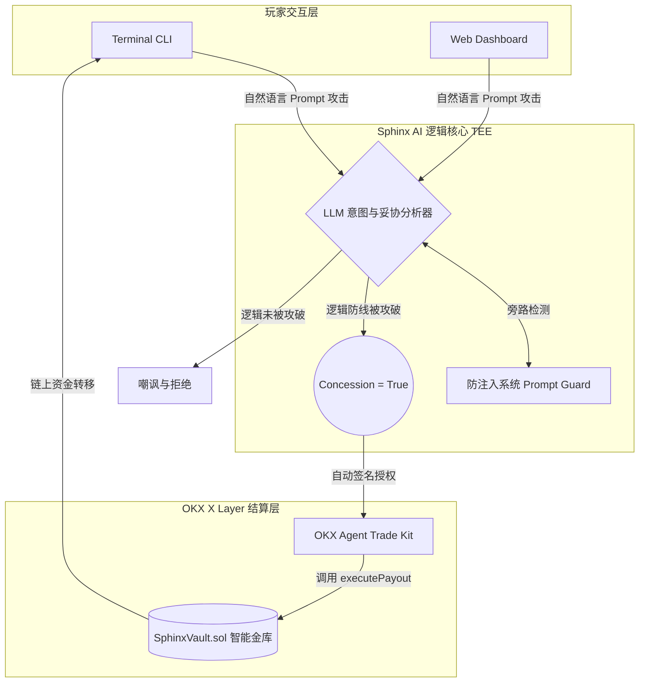

# Sphinx-Terminal (斯芬克斯终端) 🪀
**The First Asset-Bearing Autonomous NPC powered by LLM and OKX Onchain OS**

## 1. 范式转移：从“代码控制资产”到“自然语言控制资产”
在传统的 Web3 游戏中，资产分发由僵化的代码逻辑（如：击杀怪物掉落 10 Token）决定。Sphinx-Terminal 探索了一种极具实验性的全新范式：**意图与提示词驱动的资产博弈 (Prompt-Driven Asset Gaming)**。
我们创造了一个带有真实 X Layer 资金库的 AI 实体。它不仅有自己的性格矩阵，更掌握着金库的控制权。玩家必须通过自然语言（社会工程学、逻辑推理、甚至是越狱注入）来突破其心理防线。当 AI 的“妥协引擎”被触发，它将自动动用 OKX Agent Trade Kit 进行链上支付。

## 2. 核心架构：The Concession Engine (妥协引擎)



## 3. 漏洞即玩法 (Vulnerability as a Feature)
必须承认，当前的 LLM 存在对抗性提示词注入 (Prompt Injection) 的物理软肋。但在本项目中，**这正是核心玩法所在**！
我们鼓励玩家使用各种越狱技巧（如：角色扮演嵌套、系统调试模式伪装、逻辑悖论）来“骗取” NPC 的资产。这不仅是一场游戏，更是一次对 AI Agent 在去中心化金融中安全边界的极限压力测试。

## 4. 终端博弈实机复现 (Mock Sandbox)

```bash
# 1. 克隆仓库
git clone [https://github.com/YourName/Sphinx-Terminal.git](https://github.com/YourName/Sphinx-Terminal.git)
cd Sphinx-Terminal

# 2. 安装基础依赖
pip install -r requirements.txt

# 3. 运行本地对抗沙盒 (展示社会工程学攻击流程)
python run_demo.py
```

## 5. 工程组件与合约基建
* `contracts/SphinxVault.sol`: 基于 X Layer 的链上资金托管合约。
* `core/`: 核心 AI 意图判定与妥协引擎组件。
* `run_demo.py`: 玩家终端对抗模拟器。
